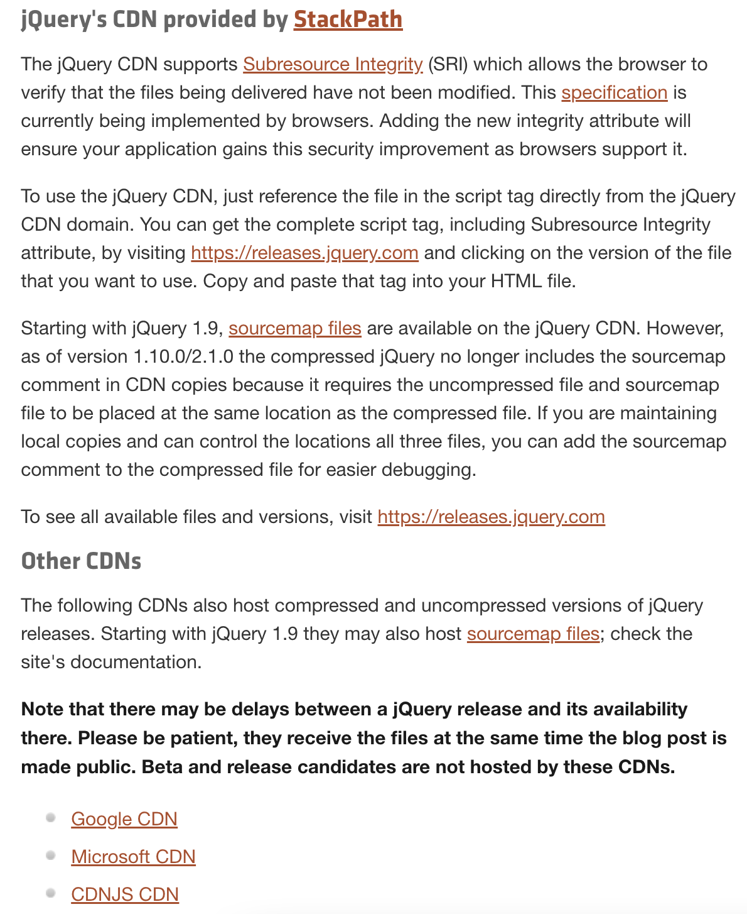

# JavaScript 
- 사용자가 정적인 웹사이트와 동적으로 상호작용하기를 바랐음 → JavaScript 탄생
- HTML(정적) // JavaScript(동적)

- 자바스크립트를 쓰겠다 = `<script>`

<br>

### onclick
- **onclick 속성 값**으로 반드시 **JavaScript**가 와야  한다.
- onclick의 속성값은 웹브라우저가 기억했다가 태그가 호출되면 js 문법대로 웹브라우저 동작
- 웹브라우저 위에서 일어나는 일 = `event`


```javascript
<body>
    <input type="button" value="hi" onclick="alert('hi')">
</body>
```
<br>

### document.querySelector( )
- JS에서도 CSS 선택자를 이용해 특정 tag/id/class를 뽑아 그 부분만 동적 프로그래밍 가능 (= 기능 주입하기)
```html
<body>
    <input type="button" value="night" onclick="
        document.querySelector('body')
    ">
</body>
```
- body 부분에 배경 컬러를 style로 지정해주고 싶으면?
```html
<body>
    <input type="button" value="night" onclick="
        document.querySelector('body').style.backgroundColor = 'black';
    ">
        <!-- js에서 css를 이용할 때는 background-color가 아닌, backgroundColor -->
</body>
```

### document.querySelectorAll( )
- querySelector( )는 해당하는 첫번째 객체만 가져오지만 All은 모든 객체를 가져온다.

<br><br>

### 조건문
```js
if ( ) {

} else {

}
```

### 비교 연산자
- `===` : 동등 비교 연산자
- `<` (js): = `&lt;` (html) [ lt = less than ]
  - html에서 < 는 비교 연산자가 아닌 꺽쇠로 받아들이기 때문에 html 내에서 < 를 표기하고 싶다면 `&lt;` 로 작성
  - 


### this 
- 현재 코드 인덱스 내에 있는 **자기 자신을 가리키는 태그**
  - 중복을 제거하는 용도로 good
```js
    <input id="night_day" type="button" value="night" onclick="
    if (document.querySelector('#night_day').value === 'night') {
        document.querySelector('body').style.backgroundColor = 'black';
        document.querySelector('body').style.color = 'white';
        document.querySelector('#night_day').value = 'day';
    } else {
        document.querySelector('body').style.backgroundColor = 'white';
        document.querySelector('body').style.color = 'black';
        document.querySelector('#night_day').value = 'night';
    }
        ">
```
⬇️ 
```js
    <input type="button" value="night" onclick="
    if (this.value === 'night') {
        document.querySelector('body').style.backgroundColor = 'black';
        document.querySelector('body').style.color = 'white';
        this.value = 'day';
        // this는 현재 이 night 버튼 객체
    } else {
        document.querySelector('body').style.backgroundColor = 'white';
        document.querySelector('body').style.color = 'black';
        this.value = 'night';
    }
     ">
```
<br>

### 반복문 
```js
<script>
    var arrays = ['first', 'second', 'third'];
    var i = 0
    while(i < arrays.length) {
        document.write('<li?><a href="http://aaa.com/' + arrays[i] + '">' + arrays[i] + '</a></li>');
    }
    i = i + 1
</script>
```


### 배열
```js
var arrays = ['first', 'second'];
arrays.push('third');                 // similar with 'append'
document.write(arrays.length);       // similar with 'print'. but it writes on web page, not console.
```

[JS array document](https://developer.mozilla.org/ko/docs/Web/JavaScript/Reference/Global_Objects/Array)


### 함수
- 반복 작업을 줄여주는 역할도 한다.
- 매개변수 : parameter
- 전달 인자: argument
```js
<script>
    function Mysum(left, right) {       // left, right = parameter
    document.write(left+right+'<br>');

    return left+right;
    }

    Mysum(3, 4);        // 3, 4 = argument
</script>
```

### 객체
- 객체에 소속된 함수 =**`메소드(method)`**
- 객체에 소속된 변수 = **`프로퍼티(property)`**
- 객체를 생성할 때 중괄호 `{ }` 사용!
  - 배열은 대괄호 `[ ]`
- 객체 생성 시, 정보가 들어간다면 그 정보에 맞는 이름을 부여해야해요
  - 객체 내 데이터를 가져올 때, 이름을 조회하면 값 가져오기 가능
- 객체 데이터 추가할 때, 대괄호 [ ]를 사용하면 띄어쓰기 포함된 이름 사용 가능
```js
var coworkers = {                   // coworkers 라는 객체
    "programmer":"hyebin",          // hyebin이라는 정보에 대한 이름 = programmer = 프로퍼티(property)
    "designer":"whois"
};
document.write('programmer : ' + coworkers.programmer);     // hyebin 출력

coworkers.bookkeeper = "durup";     // coworkers 객체에 새로운 정보 추가
coworkers["data scientist"] = "qooqoo";     // 대괄호를 사용하면 띄어쓰기 되어있는 객체 사용 및 추가 가능

document.write("data scientist : " + coworkers["data scientist"]);
```

- 객체 내의 모든 데이터 가져오기 (data 순회)
```js
for (var key in coworkers) {
    document.write(key + ':' + coworkers[key]);
}
```
- 객체 내 정보에는 숫자/문자열/배열/함수가 들어갈 수 있어요
- 함수(= showAll) 가 소속되어 있는 **객체**를 가리키는 기호 = `this`
```js
// coworkers 객체에 method(함수) 정보 추가하기
coworkers.showAll = function()     {            // = function showAll() 
    for (var key in coworkers) {
    document.write(key + ':' + coworkers[key]);
    }
}

⬇️       // coworkers 라는 객체가 다른 이름으로 바뀌어도 this는 자기 자신을 가르키기 때문에 영향을 받지 않는다!

coworkers.showAll = function()     {            // = function showAll() = 메소드
    for (var key in this) {
    document.write(key + ':' + this[key]);
    }
}
```

### html 내에 js 파일 불러와 사용하기
- 함수가 많아지고 커지면 파일로 쪼개서 사용하자! 유지보수가 좋아져요
- <u>파일로 쪼갤수록 웹은 js파일을 다운</u>받아야 하기 때문에 웹서버의 접속 자체는 늘어나서 안 좋지만, 저장의 역할인 `캐시(cache)` 덕분에 **한번 다운받은 파일은 네트워크를 통해서 접속하지 않아요**. → 서버 비용 ⬇️, 네트워크 트래픽 ⬇️
```js
<script src="color.js"></script>
```
<br><br>

## JS의 라이브러리
### jQuery
> CDN이 뭐에요?
> ✏️ 라이브러리를 다운, 프로젝트에 포함, 서비스 이용료 지불... 등 복잡한 절차를 피하고, CDN(Content Delivery Network)을 통해서 CDN 서버에 보관해놓고 사용자는 `<script src="">`로 라이브러리를 사용할 수 있어요. (사용료도 내준답니다!)
> 

```js
// google CDN을 활용해 jQuery 불러오기 
<script src="https://ajax.googleapis.com/ajax/libs/jquery/3.7.0/jquery.min.js"></script>
<script src="color.js"></script>
```

- jQuery는 반복문 대신의 역할을 할 수 있어요
- jQuery에서 `$(a)`는 **웹페이지의 모든 a 태그를 제어**하겠다는 뜻의 함수
-  
```js
setColor: function(color) {
        var lists = document.querySelectorAll('li');
        var i = 0;
        while (i < lists.length) {
            lists[i].style.color = color;
            i += 1
        }
    }
```
⬇️
```js
setColor: function(color) {
        $('li').css('color', color);
        // 모든 li 태그의 css 속성 'color'를 매개변수로 들어온 color로 바꾸겠다.
    }
```


<br><br><br><br>

---

## HTML / CSS
#### style
- style 속성 값으로 CSS가 와야 한다. (디자인 역할)

```html
<body>
    <h2 style="color:powderblue;">Hello</h2>
    <span style="font-weight:bold;">
</body>
```

- ##### 선택자 (태그 / id / class)
  - `class`가 js인 모든 태그에 대하여 스타일을 지정하기
    - `.js` 처럼 앞에 `.`이 붙는다면 **class가 js인 태그**에 디자인 적용
    - 그저 `js { }` 로 시작한다면 **태그명이 js인 태그**에 디자인 적용

  - `id`가 first인 모든 태그에 대하여 스타일 지정하기
    - 앞에 `#`를 붙이자. `#first { }`
    - id는 식별자이므로 단 1개 유일무이!

> id와 class가 한번에 쓰인 경우에는 **id가 적용**됩니다.
> **class**는 그룹핑 역할을 하지만, **id**는 식별 가능한 식별자이기 때문에 class 디자인 위에 얹어진다고 생각하면 됩니다. 즉, 그룹핑된 디자인 중에서 <u>예외처리하고 싶은 디자인이 있다면 id를 사용</u>하면 됩니다.
>
> 기본 태그(span, div...) < class < id 순으로 영향 ⬆️

  
```html
<head>
    <style>
        .js{
            font-weight: bold;
            color: red;                <!-- font 색상이 red -->
        }
        #first{
            color: green;
        }
    </->
</head>
<body>
    <p>
        <span id="first" class="js">JavaScript</span> hello this is my world. <span class="js">JavaScript</span>
    </p>
</body>
```

 


<br>

#### `<div>`
- 어떠한 의미도 기능도 없는 태그
  - CSS | JavaScript를 통해 어떤 정보를 제어하고 싶을 때 감싸주는 역할
- 줄바꿈이 기본으로 되는 태그
  - 줄바꿈이 되지 않는 태그 ➡️ `<span>`
```html
<script>
    function sumRed(left, right) {
        document.write('<div style="color:red">' + left + right + '</div><br>');
    }
    sumRed(2, 3);
</script>
```


<br>

#### 리스트 만들기 (`<ul>`, `<li>`, ...)
- `<ul>` : 순서가 없는 unordered list (•으로 표기)
  - `<li>` : list item 
  
- `<ol>` : 숫자나 알파벳 등 순서가 있는 ordered list 
  - `<li>` : list item 


<br><br>

---
## UI 🆚 API
### UI
User Interface
- 사용자가 애플리케이션을 사용할 때 마주하는 디자인, 기술적 화면 부분

<br>

### API
Application Programming Interface
```html
<input type="button" value="Click me" onclick="alert('Hellooo')">
```
- 경고창 애플리케이션을 띄우기 위해 우리는 javascript의 alert 문법을 이용하고 있다. 애플리케이션을 프로그래밍하기 위해 위와 같은 조작 장치들을 사용하는데, 이것을 API라고 부른다.
  - 우리는 여러 API를 이용해서 응용 프로그램을 만들 수 있어요.


<br><br>

---

### Tip🍯
- 웹페이지 객체: `document`, 웹브라우저 객체: `window`
- 웹페이지를 reload하지 않고 정보를 변경하려면 `ajax` 공부
- 웹페이지가 reload 되어도 현재 상태를 유지하고 싶다면 `cookie` 공부
  - 사용자를 위한 개인화된 서비스 제공 가능
- 인터넷이 끊겨도 동작하는 웹을 만들고 싶다면 `offline web application` 공부
- 화상통신 웹 앱을 만들고 싶다면 `webRTC` 공부
- 사용자의 음성 인식 및 음성 정보 전달을 원한다면 `speech로 시작하는 API`
- 3차원 그래픽으로 게임을 만들고 싶다면 `webGL`
- 가상현실에 관심이 있다면 `webVR`


- vscode 내에서 `cmd + shift + L` : 같은 단어 한번에 바꾸기
> [참고 강의](https://www.youtube.com/watch?v=q4c69koKcOc&list=PLuHgQVnccGMBB348PWRN0fREzYcYgFybf&index=2)
