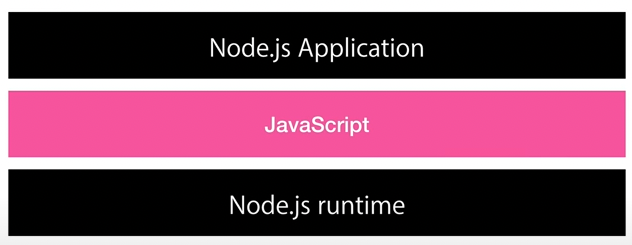
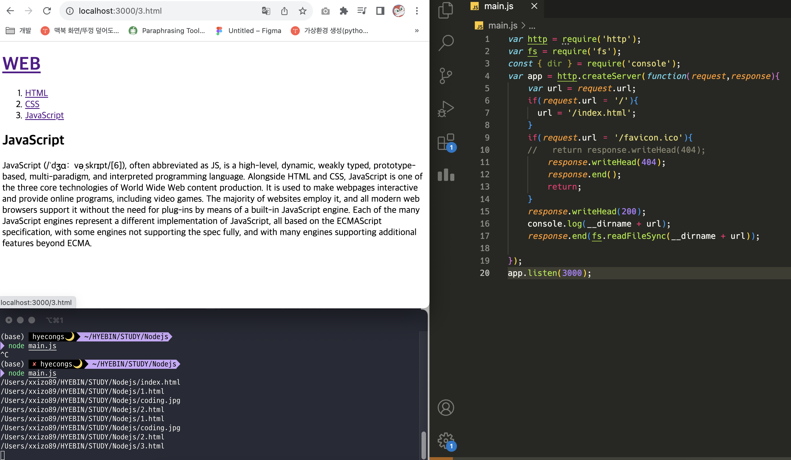
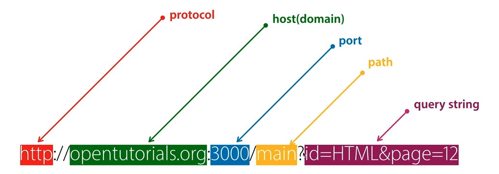
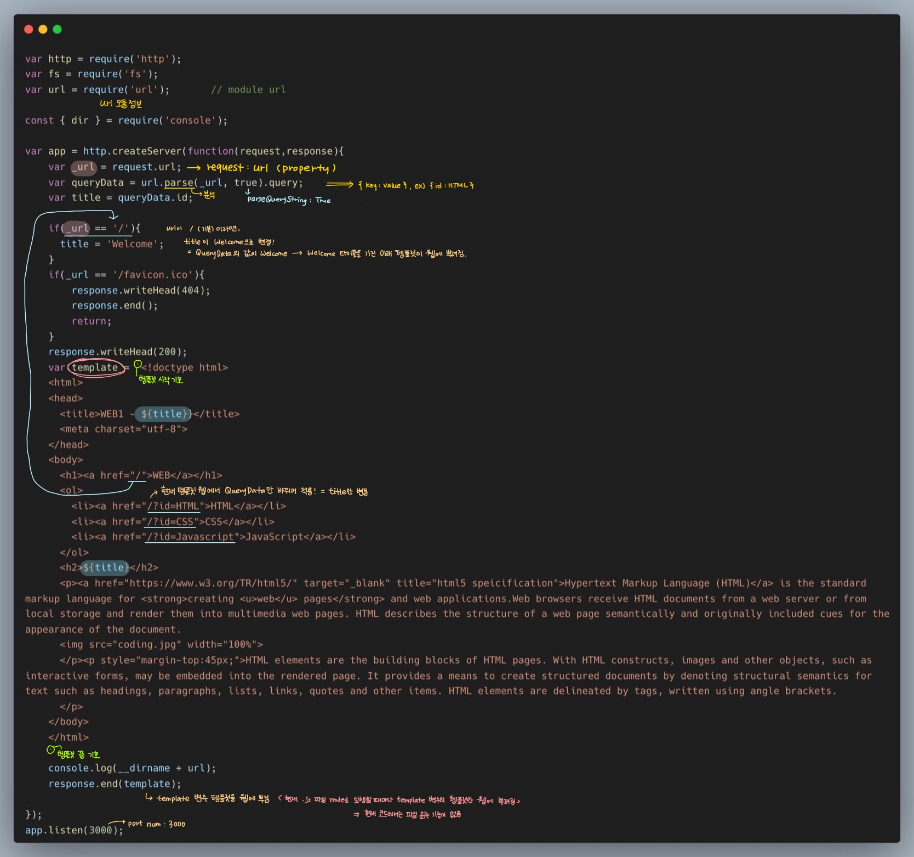
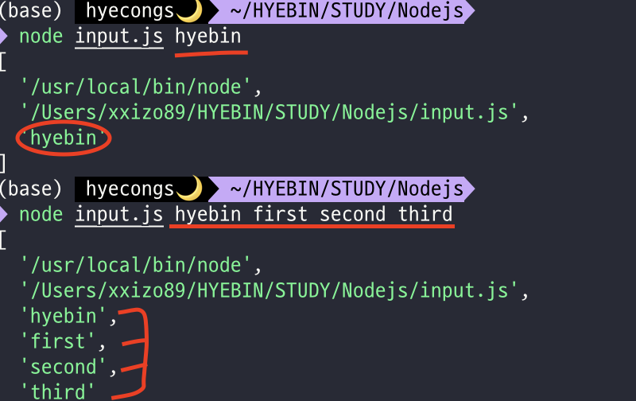
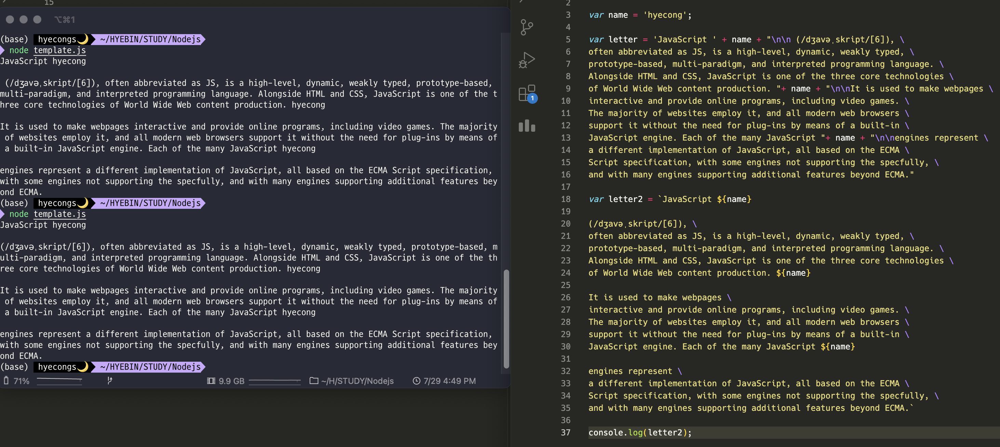

> 매번 HTML로 웹을 작성하게 되니까 유지보수가 어려워져, 기계가 자동으로 웹을 작성하길 바랐다. 또한, 웹 개발자들은 새로운 컴퓨터 언어를 배우지 않고도 웹 페이지를 자동으로 생성하는 서버 쪽 애플리케이션이 있었으면 했는데, 이것이 바로 → Node.js

<br>

<!-- TOC -->

- [Node.js](#nodejs)
  - [URL](#url)
    - [URL을 통해 입력된 값 사용하기](#url을-통해-입력된-값-사용하기)
    - [url.parse(\_url, true)](#urlparse_url-true)
  - [CRUD](#crud)
    - [Read file (node.js)](#read-file-nodejs)
  - [콘솔에서 입력값 주기 (input parameters)](#콘솔에서-입력값-주기-input-parameters)
  - [Not found](#not-found)
  - [Node.js로 파일 목록 알아내기](#nodejs로-파일-목록-알아내기)
  - [JavaScript 추가 정보](#javascript-추가-정보)
    - [**Template** Literal : 문자를 표현하는 편리한 방법](#template-literal--문자를-표현하는-편리한-방법)

<!-- /TOC -->


# Node.js 
- JavaScript가 웹브라우저를 제어하는 것이였다면, Node.js는 자바스크립트를 이용해 컴퓨터 자체를 제어
>  <br>
> 본래 웹브라우저 위에서 HTML 언어를 사용해 웹 애플리케이션을 생성 <br>
>  <br>
> 위와 비슷하게, Node.js runtime 위에서 JavaScript를 통해 Node.js 애플리케이션을 생성 


- 실행방법
  - editor에서 작성한 .js 파일을 `터미널`에서 `node @@@.js` 해서 파일 열어주면 실행 가능

---

- Node.js는 **웹서버 기능**(= Apache)을 할 수 있다
  - 
  - 다른 페이지를 요청할 때마다 코드 16행의 console.log가 실행되어 터미널에 로그가 찍힘
  - `url` : `/1.html`


## URL


### URL을 통해 입력된 값 사용하기
```js
var url = require('url');       // module url ✨

var app = http.createServer(function(request,response){
    var _url = request.url;     ✨
    var queryData = url.parse(_url, true).query;    ✨

    console.log(queryData);

>>> url = localhost:3000/?id=HTML
{id: 'HTML'}
// ✨을 통해 url의 쿼리만 가져오기 성공
// key name이 id이므로 queryData.id 를 출력하면 HTML만 출력
```

### url.parse(_url, true)
- url module의 parse(분석) 메소드로 요청받은 url 분석
  - `pathname`: 쿼리 스트링을 제외한 경로 자체 pathname을 보여줌
  - `path`: 쿼리 스트링이 포함된 주소
```js
var url = require('url');       // url module
var app = http.createServer(function(request,response){
    var _url = request.url;     // url 주소
    console.log(url.parse(_url, true));

>>>
Url {
  protocol: null,
  slashes: null,
  auth: null,
  host: null,
  port: null,
  hostname: null,
  hash: null,
  search: '?id=CSS',
  query: [Object: null prototype] { id: 'CSS' },
  pathname: '/',
  path: '/?id=CSS',
  href: '/?id=CSS'
}
```

<br>

> node와 js를 사용한 (본문은 정적이지만, 제목은 동적인) 웹페이지 코드 분석
> 

## CRUD 
- **C**reate **R**ead **U**pdate **D**elete
- 정보시스템의 핵심적인 메커니즘

### Read file (node.js)
- `fs.readFile`  (fs: file system)
- 터미널 상에서 node로 파일을 실행하는 것이기 때문에, 읽어올 파일 위치를 터미널 속 현재 디렉토리 기준으로 작성해야 한다. 
  > - 현재 코드 (First > Second > test.js) 
  > - sample.txt (First > Second > sample.txt) 
  > 경로가 이와 같다고 가정할 때, 터미널도 Second 디렉토리 위에서 `node test.js`를 실행해야 한다. 그래야 **코드 상의 경로로** (./sample.txt) **파일을 찾아갈 수 있기 때문**. 혹은 코드 상의 경로 자체를 터미널 위치 기준으로 작성해야 한다.
```js
const fs = require('fs');           // fs 모듈 불러오기

fs.readFile('./sample.txt', 'utf-8', function(err, data) {
    console.log(data);
});
```
<br><br>

- 아래 코드처럼 웹브라우저에서 하이퍼링크를 클릭하면 그에 맞는 파일을 읽어올 때면, 클릭할 때마다 파일을 새로 읽어오기 때문에 파일 내용은 변해도 reload해서 볼 수 있다. (굳이 main.js를 다시 종료했다 실행할 필요 X)
  - main.js가 변하면 그때는 종료했다가 재실행해야 한다...
```js
// 본문이 적힌 파일을 읽어와 동적으로 웹페이지를 바꾸는 코드 (main.js)
var http = require('http');
var fs = require('fs');
var url = require('url');       // module url
const { dir } = require('console');

var app = http.createServer(function(request,response){
    var _url = request.url;
    var queryData = url.parse(_url, true).query;
    var title = queryData.id;
    if(_url == '/'){
      title = 'Welcome';
    } 
    if(_url == '/favicon.ico'){
        response.writeHead(404);
        response.end();
        return;
    }
    response.writeHead(200);

    fs.readFile(`data/${queryData.id}`, 'utf-8', function(err, description) {

      var template = `<!doctype html>
      <html>
      <head>
        <title>WEB1 - ${title}}</title>
        <meta charset="utf-8">
      </head>
      <body>
        <h1><a href="/">WEB</a></h1>
        <ol>
          <li><a href="/?id=HTML">HTML</a></li>   ✨
          <li><a href="/?id=CSS">CSS</a></li>   ✨    // queryData.id = CSS
          <li><a href="/?id=Javascript">JavaScript</a></li>   ✨
        </ol>
        <h2>${title}</h2>
        <p>${description}</p>   ✨
      </body>
      </html>
    `
      response.end(template);
    });


});
app.listen(3000);
```

---

## 콘솔에서 입력값 주기 (input parameters)
```js
var args = process.argv;
console.log(args);
```
- `node @@@.js {입력값 ...}`
  - 1번째 줄: node runtime이 설치된 경로 (`args[0]`)
  - 2번째 줄: 현재 실행 중인 js 파일 위치 경로 (`args[1]`)
  - 3번째 줄~: 입력값 (**`args[2]`**)
    - Tip) 입력값으로 1, 2.. 와 같은 숫자를 넣어도 문자열로 반환됨 

  - 

<br>

## Not found
- `response.writeHead(200);` = file을 성공적으로 전송했다.
- `response.writeHead(404);` = file을 찾을 수 없다. [실패] = Not found!

<br>

## Node.js로 파일 목록 알아내기
- readFile과 같이 파일 경로는 실행하는 위치(terminal 위치)를 기준으로 작성!
```js
const dataFolder = './data/';
var fs = require('fs');

fs.readdir(dataFolder, function(err, filelist) {
    console.log(filelist);
})

>>>
[ 'CSS', 'HTML', 'JavaScript' ]
```
<br>

---

```js
// 응용! (파일 목록 read 및 반복문 적용 전 코드)
  var list = `<ul>
                <li><a href="/?id=HTML">HTML</a></li>   
                <li><a href="/?id=CSS">CSS</a></li> 
                <li><a href="/?id=Javascript">JavaScript</a></li>   
              </ul>`;  
```
⬇️

```js
// 파일 목록 read 및 반복문 적용 후 코드
fs.readdir('./data', function(err, filelist) {
  var list = '<ul>';
  var i = 0
  while (i < filelist.length) {
    list = list + `<li><a href="/?id=${filelist[i]}">${filelist[i]}</a></li>`;
    i += 1;
  }
  list = list + '</ul>';
}
// 템플릿 html 코드에는 ${list} 로 바꿔주면 👍🏻
```


<br><br><br><br>

---

## JavaScript 추가 정보

### **Template** Literal : 문자를 표현하는 편리한 방법
> Literal이란?
> < 문자열을 표현할 때는 ""를, 숫자를 표현할 때는 아무런 기호 없이 2, 3... >
> 위와 같이 데이터 타입, 즉 정보를 표현하는 기호를 Literal이라고 해요.
- 코드를 템플릿으로 바꾸기 위해서는 ``` ` ``` 사용!

  - 변수 사용은, `${ }` & 엔터는 `스크립트 상에서 엔터`하면 그대로 적용 가능
    - 템플릿 이용하면 불필요한 `+` 기호나 `\n` 개행문자 제거 가능

<br><br>

> [참고 강의](https://www.youtube.com/watch?v=3RS_A87IAPA&list=PLuHgQVnccGMA9QQX5wqj6ThK7t2tsGxjm&index=1)
