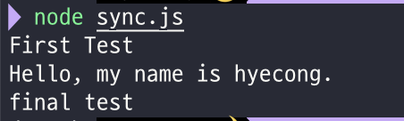
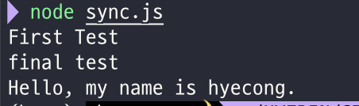
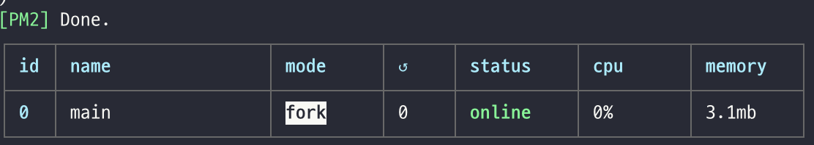

<!-- TOC -->

- [Node.js](#nodejs)
  - [동기 🆚 비동기](#동기--비동기)
    - [readFileSync( )](#readfilesync-)
    - [readFile( )](#readfile-)
  - [Callback](#callback)
  - [Package Manager(패키지 매니저)](#package-manager패키지-매니저)
    - [NPM](#npm)
  - [POST 방식으로 받은 데이터 가져오기 (Node.js)](#post-방식으로-받은-데이터-가져오기-nodejs)
  - [리다이렉션(Redirection)](#리다이렉션redirection)
    - [번외) writeHead(301) 뜻](#번외-writehead301-뜻)

<!-- /TOC -->

<br>

# Node.js

## 동기 🆚 비동기
- 동기(synchronous): 데이터의 요청과 결과가 동시에 일어나는 것
  - 데이터 요청을 하면 처리 시간이 아무리 오래 걸려도 기다렸다가 요청한 곳에서 응답을 받습니다.
  - 여러 작업이 존재할 때도, 이전 작업이 종료가 되어야 다음 작업이 시작됩니다.
  - Ex 📄) 사용자가 서버에게 데이터를 요청하면, 응답을 받을 때까지 사용자는 다른 활동을 할 수 없고 대기해야 합니다.
### readFileSync( )
- callback 함수없이 **return 값을 줍니다**.
```js
var fs = require('fs');

console.log('First Test');
var result = fs.readFileSync('./sample.txt', 'utf8');
console.log(result);
console.log('final test');
```


- 비동기(asynchronous): 데이터의 요청과 결과가 동시에 일어나지 않는 것.
  - 데이터 요청을 하고 응답이 올 때까지 기다릴 필요없이 다른 활동하거나 다른 요청을 전송해도 됩니다.
  - 한쪽은 일을 맡겨놓고, 한쪽은 다른 일을 진행하는 병렬적인 방법으로 동시에 여러 작업을 처리합니다.

### readFile( )
- **Node.js의** 파일 읽는 메소드 **default**가 비동기 (= node.js가 비동기 선호)
- readFile() 비동기는 <u>return 없이</u> **callback 함수**가 필요합니다.
```js
console.log('First Test');
fs.readFile('./sample.txt', 'utf8', function(err, result) {
    console.log(result);
});
console.log('final test');
```



## Callback
-  아래 코드의 뜻 → readFile 하는동안 시간이 좀 걸리니까 끝나면 3번째 인자인 function을 실행시켜!
    - 그다음에 처리할 작업은 callback 함수 안에 있어
```js
fs.readFile('./sample.txt', 'utf8', function(err, result) {
    console.log(result);
});
```

```js
// function a() {
//     console.log('A');
// }

var a = function() {        // 변수에 함수를 할당. js에서는 함수가 값이 될 수 있다.
    console.log('A');
}

// 위의 2개는 똑같다.

// a();

function slowfunc(callback){
    callback();
}

slowfunc(a);        // a 함수를 매개변수로
```


## Package Manager(패키지 매니저)
### NPM
- 가장 기본적이고 많이 쓰이고 있는 Node.js 패키지 매니저
- PM2의 역할
  - node를 사용해서 실행한 프로그램(프로세스)을 (main.js) 감시하다가 자동으로 프로세스가 꺼지면 다시 실행시켜주는 역할
  - 파일이 수정되는지 관찰하다가 파일이 수정되면 자동으로 껐다 켜서 수정된 파일을 실행하는 역할

- pm2 시작하기: `pm2 start {node로 실행시키고 싶은 파일}.js`
  - 
- 모니터링하기: `pm2 monit`
- 실행중인 pm2 리스트 뽑아보기: `pm2 list`
- pm2 종료하기: `pm2 stop {프로세스 이름}`
- 실행 파일 수정되는지 관찰하기: `pm2 start {프로세스}.js --watch`


<br>

## POST 방식으로 받은 데이터 가져오기 (Node.js)
- `request.on('data', function(data) { });`
- `request.on('end', function() { });`
- 위의 2개 이벤트(**`'data'`**, **`'end'`**)를 통해 POST 방식 데이터를 가져올 수 있다.
```js
var body = '';

    // 서버에서 데이터를 받을 때마다 서버는 콜백함수 <function(data)> 를 호출하면서 data라는 인자에 수신한 정보를 담고 있어요.
    request.on('data', function(data) {
      body += data;
      // console.log(body);  >>> title=nodejs&description=this+is+my+note
    });

    request.on('end', function() {
      var post = qs.parse(body);      // body를 인자로 주면, post 변수에 post 정보가 들어있을 것 (정보 데이터 전환 => 객체화✨)

      // console.log(post)

      /* >>> [Object: null prototype] {
        title: 'nodejs',
        description: 'this is my note'
      }
      */
      var title = post.title;
      var description = post.description;     
      // post로 받은 데이터 가져오기 성공!
    });
```


## 리다이렉션(Redirection)
- 사용자를 특정 페이지로 넘기는 액션
- `writeHead(302, Location: 가고싶은 주소)`
```js
response.writeHead(302, {Location: `/?id=${title}`});
```


### 번외) writeHead(301) 뜻
❗️ 번외) `response.writeHead(301, {Location: 'http://~~});` : "현재 주소는 이 주소로 영원히 바뀌었습니다. 앞으로는 이 주소로 오세요." 라는 뜻 (`301`의 뜻)