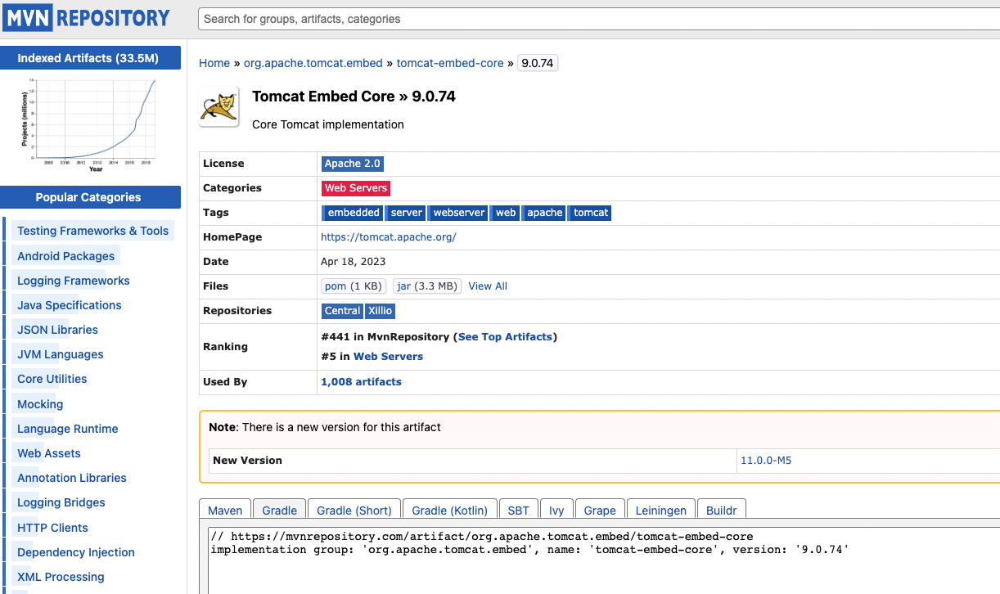
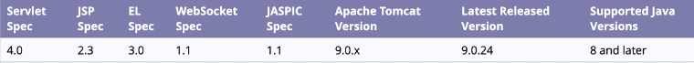

### 🔔 외부 라이브러리(dependencies)의 코드 긁어오기

https://mvnrepository.com/
<br>
↑ 위의 사이트에서 원하는 dependencies 코드 확인 가능 



- 아래와 같이 불필요한 부분 제거해 깔끔하게 implementation 가능

```java
implementation group: 'org.apache.tomcat.embed', name: 'tomcat-embed-core', version: '9.0.74'

⬇

implementation 'org.apache.tomcat.embed:tomcat-embed-core:9.0.74'
```


<br><br>

- 나의 개발 환경
  - Tomcat version: 9.0.74
  - Servlet version: 4.0
  - java version: 11.0.19




<br><br>
---
강의: [fastcampus] 10개 프로젝트로 완성하는 백엔드 웹개발(Java/Spring) 초격차 패키지 Online.