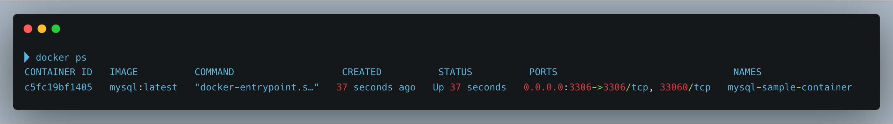
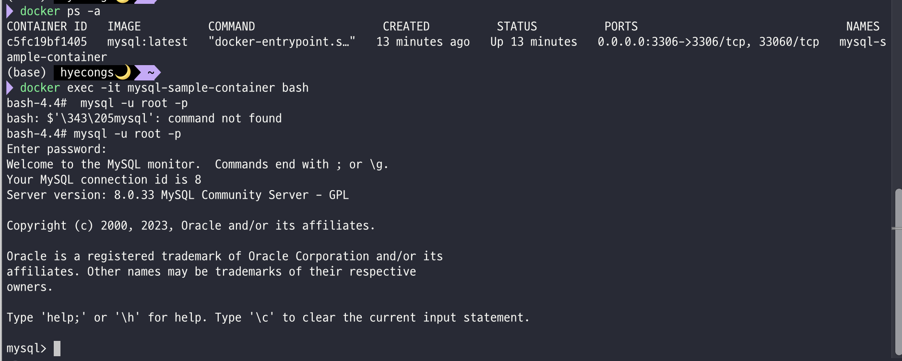

### 도커 컴포즈

- 웹, sql, kafka 등 여러 컨테이너를 정의하고 한개의 yaml 파일에서 실행하기 위한 도구

```yaml
version: "3.9"
services:
    web:
        build: . 
        ports:
            - "8000:5000"
        volumes:
            - .:/code
            - logvolume01:/var/log
        links:
            - redis
    redis:
        image: redis
volumes:
    logvolume01: {}
```

위의 `services`를 통해 `web`과 `redis` 서비스를 한번에 정의 및 실행 가능

<br><br>

---

# Docker 🐳
https://hub.docker.com/ : docker 허브 이미지 사이트

<br>
  

### docker 명령어
- 도커 컨테이너 생성 (ex. mysql)
  - `docker run --name {도커 컨테이너명 설정} -e MYSQL_ROOT_PASSWORD={비밀번호} -d -p 3306:3306 mysql:{이미지 버전}`

    ⬇️

  - `docker run --name mysql-sample-container -e MYSQL_ROOT_PASSWORD=root -d -p 3306:3306 mysql:latest`

    - `-p`: 연결 포트번호 설정

<br>

- 현재 실행중인 도커 컨테이너 목록 출력
  
  - `docker ps -a`
    



- 원하는 도커 컨테이너 접속
  
  - `docker exec -it {도커 컨테이너 이름} bash`
    
- 컨테이너 내 mysql 접속
  
  - `mysql -u root -p`
    
  - password를 치면 컨테이너 내의 mysql에 접속이 가능
  
