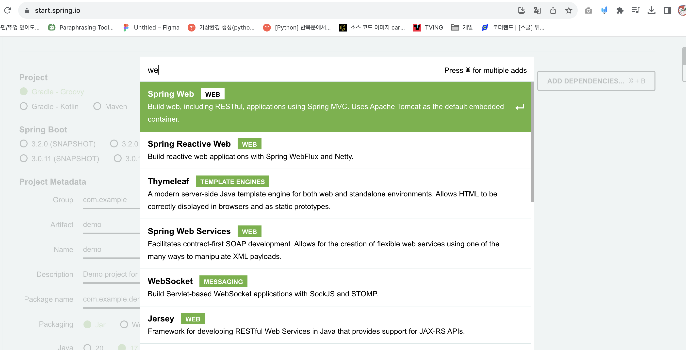
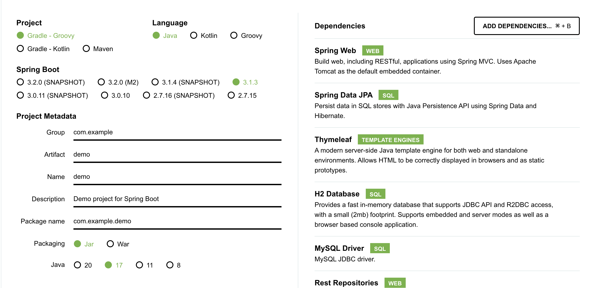
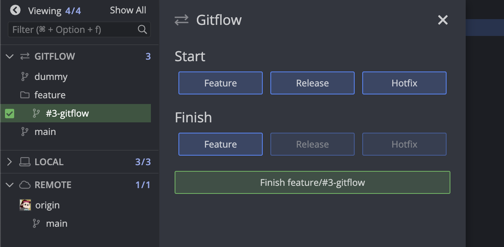
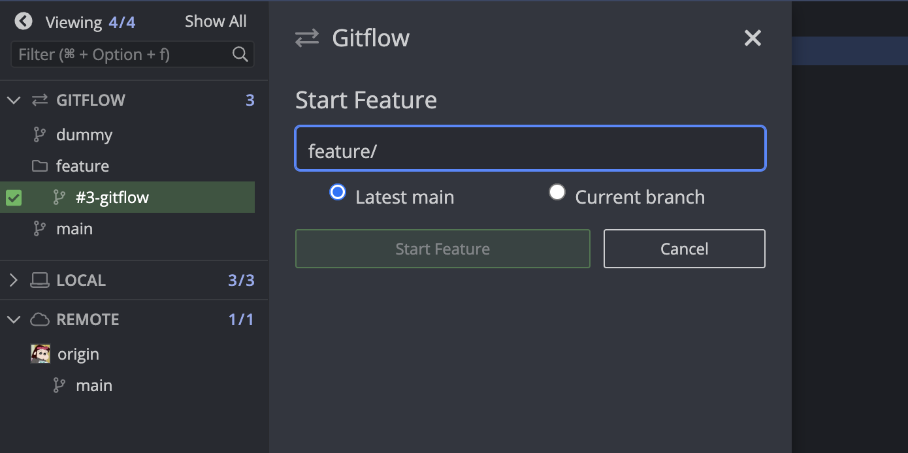
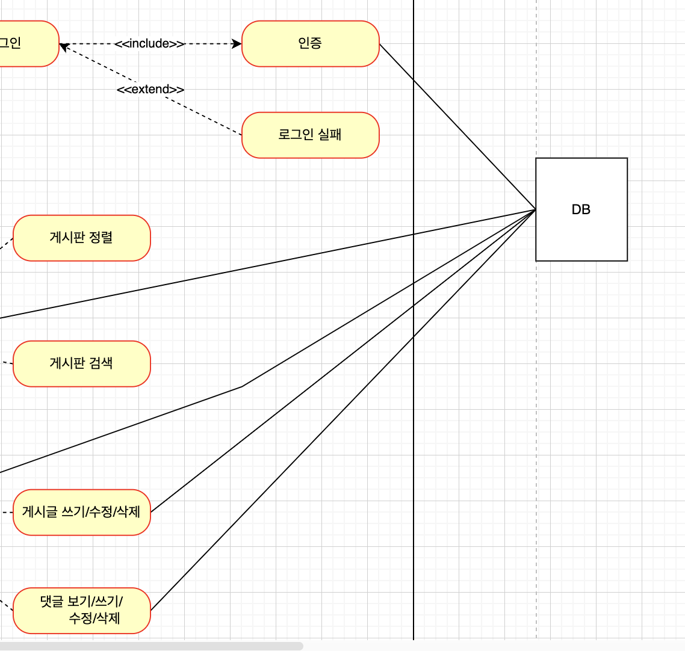
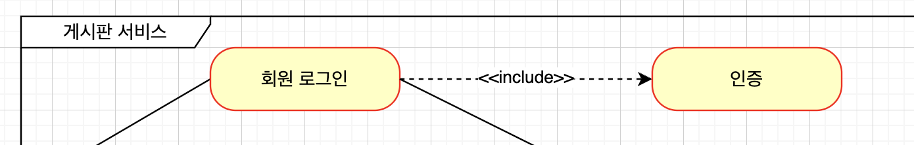
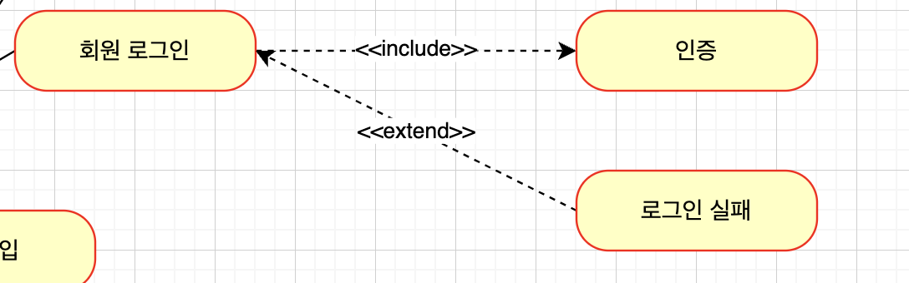
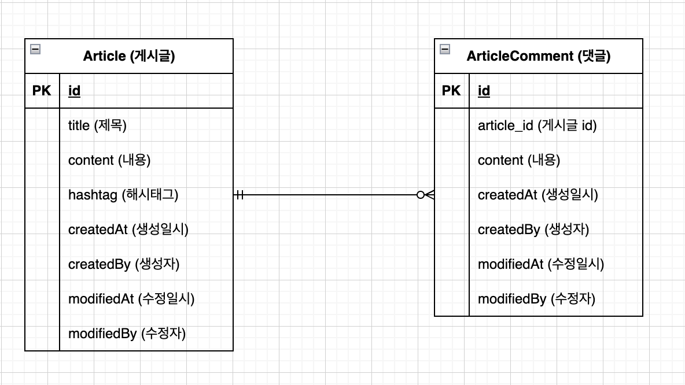

[문제 → 요구사항 → 기능(feature) 도출 → 구현 방안의 기획 → 개발 계획 수립 → 실행]

 

# 문서작업
**도메인 및 ERD 설계 & 유즈케이스 작성**
- diagrams.net 사용

**API 디자인**
- 구글 시트

**프로젝트 관리 및 협업 환경**
- Git + Github

---
 

# 테스트와 배포
### 테스트
- 개발 요구사항이 모두 구현되었는가?
- 구현된 요구사항이 오류없이 잘 동작하는가?

[테스트 사용 가능 방법]
1. JUnit 5
2. 각종 테스트 라이브러리 (Mockito, AssertJ ...)
3. Spring Boot 슬라이스 테스트 테크닉
4. 깃헙 내 테스트/빌드 자동화

 

### 배포
- 깃헙 릴리즈 작성
- 클라우드 서버에 배포 (이번 프로젝트는 헤로쿠[Heroku] 사용)
  
---
 

# 세부 기능
- 게시판, 댓글 도메인의 설계
- 도메인 데이터를 DB 에 저장
- JSON API 로 데이터 제공
- 사용자에게 웹 화면으로 서비스 제공 + 디자인 요소
- 게시판 페이지 / 게시글 페이지 / 로그인 페이지
- 적절한 입출력 데이터의 검증
- 인증 기능
- 생산성에 도움이 되는 도구들 선택

 

# 사용 기술
==== Java + Spring Boot 기반으로 기술 선택 ====

 

- 웹 서비스 제공 ➡️ Spring Web
- 도메인의 설계와 DB 저장 ➡️ Spring Data JPA, H2 Database, MySQL Driver
- JSON API 로 데이터 제공 ➡️ Rest Repositories, Rest Repositories HAL Explorer
-  웹 화면: 강의 목표에 맞춰 서버 사이드 렌더링으로 접근 ➡️ 템플릿 엔진 ➡️ Thymeleaf
- 디자인 요소 ➡️ Bootstrap 5.2
- 적절한 입출력 데이터의 검증 ➡️ Validation
- 인증 기능 ➡️ Spring Security
- 생산성 ➡️ Lombok, Spring Boot DevTools, Spring Boot Actuator

➡️ start.spring.io

# 깃 브랜치 전략 세우기
### gitflow
- main
  - 제품으로 나갈 수 있는 최종 브랜치
- develop
- feature
  - 개개인의 자기 개발 용도
- release
  - 간단한 QA 및 버그 fix를 통해 배포 직전 
- hotfix
  - 운영 중 긴급하게 대응해야하는 심각한 이슈가 있을 때 사용하는 용도

### github flow
- main
- feature (개발)

**⬇️ `gitKraken`의 `gitflow` 기능을 통해 <u>github flow</u> 방식을 적용해보자!**

- dummy 브랜치 하나 만들고 그 dummy를 Master로 (Master는 안 쓸 거니까)
- 원래 main 브랜치는 Develop으로 (github flow 방식으로 개발한다면, gitKraken에서 최종 브랜치는 Develop에 있는 것.)

- gitflow가 생기면서 간편하게 feature 내 새로운 브랜치 생성이 가능하다.
  - `#3-gitflow` = 이슈 넘버(#3) - 이슈 제목(gitflow)

➡️ gitflow 도구를 사용하면 간편하게 feature 브랜치들을 디렉토리화 가능!

  

# Use-case (유스케이스)

- `____` : 실선 (연관관계)
  - `인증, 게시글 쓰기/수정/삭제, 댓글 보기/쓰기..` 모두 DB에 저장되어야 하므로 DB와 연관이 있다.

- `---<<include>>--->` : 포함관계
  - `인증`은 `회원 로그인` 안에 포함되어있다. (인증 ⊂ 회원 로그인)

- `<<extend>>` : 확장 관계
  - 기능이 일어남으로써 발생할 수 있는 여러가지 분기
  - `회원 로그인` 기능이 실행됨으로써 `로그인 실패`는 여러가지 발생할 수 있는 상황 중 하나

- 게시글 하나당 댓글은 0 ~ 여러 개