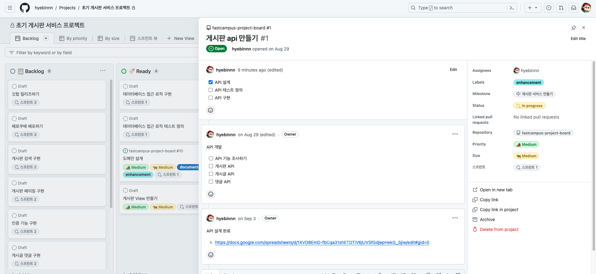

## issue
- 프로젝트를 진행하면서 발생하는 다양한 이벤트
  - 발견된 버그, 구현 예정 기능, 개발 이슈, 설계 사항 등을 이슈로 만들어서 협업 가능

### Labels
- 각 이슈가 어떤 종류의 이슈인지 구별하기 위해 사용

### Milestones
- 유사한 이슈들을 모아 일정관리를 할 수 있는 기능
  - Sprint 개발 방법론은 지원하는 기능
  - 개발 목표를 마일스톤으로 설정 후, 관련 이슈들을 생성 → 이슈들의 Open / Close 상태를 추적하여 Close 개수를 %화하여 마일스톤의 진행도 확인 가능
  

 

## Pull requests
- 코드 변경 사항을 다른 브랜치로 병합하기 위해 request를 생성하는 도구

 

## Actions
- CI/CD (지속적 통합/지속적 배포) 및 자동화를 위한 기능
  - 코드가 저장소에 푸시될 때마다 일련의 작업(테스트, 빌드, 배포 등)을 자동으로 실행 가능

## Projects
- 프로젝트를 시각적으로 관리하기 위한 도구 (notion의 board view와 비슷한 생김새)
  - issue로 변환도 가능하다
  

## Wiki
- 프로젝트의 문서화를 위한 기능
- README 파일 외에도 프로젝트에 대한 추가적인 문서를 작성하고 공유가 가능하다