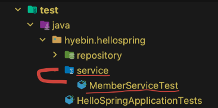
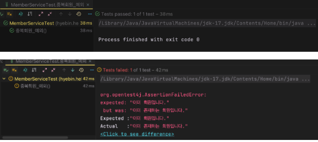

[회원 서비스 테스트]

### IntelliJ 단축키

- 이전에는 테스트할 때 test > java > hello.hellospring에서 test용 패키지를 만들어 사용했는데, 훨씬 쉽게 테스트하는 방법이 존재한다!
  
  - 테스트하고 싶은 class에서 `cmd+shift+T` → [Create New Test] 클릭
    아래 사진처럼 <u>service > MemberServiceTest</u> : **패키지 > 파일 자동 생성**
    
    
    
- test 파일은 과감하게 함수명을 한글로 써도 된다!
  

---

- `ctrl + shift + R` : 현재 코드 재실행
  
- `ctrl + R` : 이전 코드 실행 (유용하게 쓰인답니다!)

<br><br>

### Test 메커니즘

- given: 이러한 <u>상황이 주어졌을 때</u>, (현재 test는 이런 데이터를 기반으로 하는구나!)
  
- when: 이것을 <u>실행했을 때</u>, (현재 test는 이런 것을 검증하는구나!)
  
- then: <u>결과</u>는 이렇게 나와야 한다.
  

```java
void 회원가입() {
        // given
        Member member = new Member();
        member.setName("hello");

        // when
        Long saveId = memberService.join(member);

        // then
        Member findMember = memberService.findOne(saveId).get();
        org.assertj.core.api.Assertions.assertThat(member.getName()).isEqualTo(findMember.getName());
        // assertThat은 assertj의 Assertion의 메소드!    
}
```

⭐️ Test는 정상 flow만 검증하는 것이 아닌, 예외도 늘 검증해야한다!

#### assertThat()

- **assertThat()** 은 expected와 actual을 알려주어 검증하기 편하다.
  < true > / < false >
  
  
  

#### assertThrows()

- 예외 검증할 때, 일일히 try-catch문을 사용하기보다 `assertThrows()` 사용 추천!
  
  - **assertThrows(`expected 에러 타입`, `실행 logic`)** : 특정 logic을 실행하면 expected 에러가 터져야 한다.
    
  - assertThrows()는 에러 메시지를 return 해준다.
    

```java
@Test
    public void 중복회원_예외() {
        // given
        Member member1 = new Member();
        member1.setName("spring");

        Member member2 = new Member();
        member2.setName("spring");

        // when
        memberService.join(member1);

        try {
            memberService.join(member2);
            fail();             // 에러가 발생해야하는데(=catch로 바로 넘어가야 하는데) join()이 수행되면 fail() -> 실패한 것임
        } catch (IllegalStateException e) {
            org.assertj.core.api.Assertions.assertThat(e.getMessage()).isEqualTo("이미 존재하는 회원입니다.");
        }

↓

@Test
    public void 중복회원_예외() {
        // given
        Member member1 = new Member();
        member1.setName("spring");

        Member member2 = new Member();
        member2.setName("spring");

        // when
        memberService.join(member1);
        IllegalStateException e = assertThrows(IllegalStateException.class, () -> memberService.join(member2));
        org.assertj.core.api.Assertions.assertThat(e.getMessage()).isEqualTo("이미 존재하는 회원입니다.");
```

- 매 함수 끝날 때마다 데이터를 clear하지 않으면 DB에 계속해서 저장되서 일회성 테스트 불가능
  
<br><br>

### Dependency Injection: 의존관계주입

- 문제 상황: 데이터 clear를 해주기 위해 <u>MemoryMemberRepository()를 new로 새로운 객체를 test 파일에서 추가 생성</u>을 해준 상황
  
  ```java
  MemoryMemberRepository memberRepository = new MemoryMemberRepository();     //  load for data clear after each method finished
  ```
  
  → 쓸데없이 **독립적인 객체가 2개**가 생긴 것이기 때문에 메모리 측면으로 안 좋고, 객체가 품고 있는 값이 각각 달라지는 상황이 발생할 수도 있기에 좋지 않다.
  
  → **만약 DB 역할을 하는 repository의 본 클래스가 static 으로 만들어진 클래스가 아니라면, 완전히 다른 DB가 생긴 것**이라 큰 문제 발생 가능!
  
  ```java
  private static final Map<Long, Member> store = new HashMap<>();
  
  // 지금처럼 저장하는 DB 역할 공간(store)이 static이 아니었다면 완전히 다른 DB store가 생기는 것
  // MemoryMemberRepository.java
  ```
  
  - **✏️ solution**: test 당하는 클래스(Memberservice)와 test 내의 repository를 동일시해주자 → test에서 만든 repository 객체를 MemberService 클래스에서 쓰자
    
  
  ```java
  public class MemberService {
      private final MemberRepository memberRepository = new MemoryMemberRepository();
      ... 
  }
  
  ↓
  
  public class MemberService {
  
      private final MemberRepository memberRepository;
  
      // cmd + N 을 통해 constructor을 generate해주면 외부의 매개변수 memberRepository를 내부에서 사용할 수 있게끔 함수를 자동 생성해주어 편하다!
      public MemberService(MemberRepository memberRepository) {
          this.memberRepository = memberRepository;
      }
  ```
  
- 위처럼 MemberService 클래스 입장에서, <u>외부에서 메모리 repository(DB)가 들어오는 것</u> = **Dependency Injection 의존관계 주입 (DI)**
  
- test는 독립적으로 실행되어야 하기 때문에 beforeEach() 함수로 각각의 테스트 함수 실행 이전에 memberRepository와 서비스 객체를 생성한다.
  
  ```java
  class MemberServiceTest {
  
      MemberService memberService;
      MemoryMemberRepository memberRepository;     //  load for data clear after each method finished
  
      @BeforeEach
      public void beforeEach() {
          memberRepository = new MemoryMemberRepository();        // 매 함수 실행 전마다 객체 생성
          memberService = new MemberService(memberRepository);
      }
  
  ...
  ```
  
<br>

---

### 🍯 Tip!

- **System.out.println() 의 단축키**가 없나? 하던 중 찾은...ㅎㅎ
  
  - intellij : `sout` 타이핑 후 tab 하면 자동완성
    
  - 이클립스 : `sysout` 혹은 `syso` 타이핑 후 `ctrl + space`
