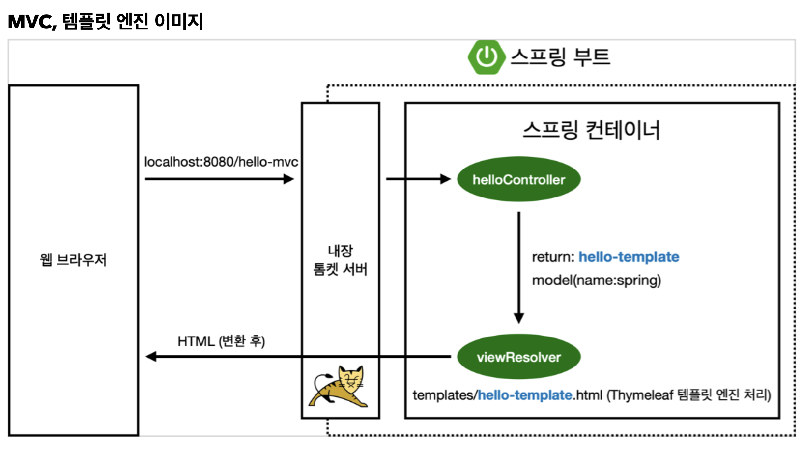
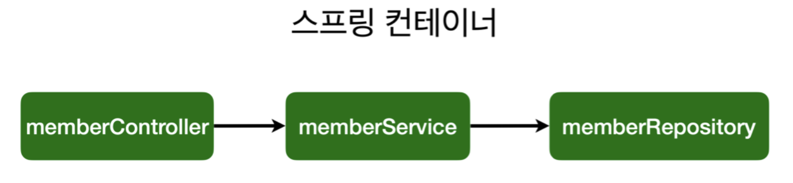

## 의존 관계 설정하기

- 멤버 컨트롤러를 생성해 회원 서비스를 통해 가입을 하고 repository를 이용할 수 있도록 엮어주자 <br> → 의존관계 설정 <html 띄워서 회원가입 받기(의존시키기)>

<br><br>

### 컨트롤러 Controller

- `@Controller` 어노테이션이 있으면 스프링 시작 시, 스프링 컨테이너 안에 컨트롤러 객체를 자동 생성해서 넣어둔다.
  



- 서비스 객체와 같은 객체들을 독립적으로 사용하지 않고, 스프링 컨테이너에 등록하고 쓸 때마다 받아쓰도록 구현해야한다.
  
  - 하나의 인스턴스를 다같이 공유하여 사용
    

<br><br>

## 순수 자바 코드를 스프링 빈에 등록하기

### 1️⃣ 컴포넌트 스캔 - 자동 의존관계 설정

- 본래 @Component로 등록 가능하나, `@Service`나 `@Repository` 내부에 `@Component`가 함유되어 있어서 사용 가능
  

```java
@Controller
public class MemberController {
    private final MemberService memberService;

    @Autowired                // spring container에 있는 memberService와 연결 시켜줌 -> error 발
    public MemberController(MemberService memberService) {          // cmd+N : 셍상자 자동 생성
        this.memberService = memberService;
    }
}
```

- 🚨**error 발생 이유**: Controller는 @를 통해 스프링 빈에 자동으로 등록되지만 MemberService는 순수 java 코드이기 때문에 <u>스프링 빈이 알 수가 없으므로</u> `@Autowired` 시, MemberService를 인식하지 못함.
  
  - `@Service`를 통해 스프링이 **서비스를 인식**하고 MemberService를 스프링 빈에 올림
    
  - 위처럼 MemberRepository도 `@Repository` 붙여주면 스프링 빈에 등록
    
    - 이 때, interface가 아닌 <u>**구현체에 어노테이션 붙여주기!**</u>
      
  - @Service ↔ MemberService(class명) // @Controller ↔ MemberController
    
  
  ```java
  @Service
  public class MemberService {
  
      private final MemberRepository memberRepository;
  
      public MemberService(MemberRepository memberRepository) {
          this.memberRepository = memberRepository;
      }
  
      public Long join(Member member) { ... }
  
      ...
  }
  ```
  

### @Autowired

- 생성자에 @Autowired를 붙이면, 컨트롤러가 생성될 때 스프링 빈에 등록되어있는 MemberService를 가져와 넣어준다 → **Dependency Injection (의존관계 주입)**
  
- MemberService에서도 MemberRepository를 DI 하므로 @Autowired 붙이기
  
  ```java
  @Service
  public class MemberService {
  
      private final MemberRepository memberRepository;
  
      @Autowired
      public MemberService(MemberRepository memberRepository) {
          this.memberRepository = memberRepository;
      }
  ```
  
  
<br>

> **⭐️Spring의 Main 함수 실행되는 곳의 패키지의 하위 폴더들만 스프링이 관리한다 <br> = 메인 함수 실행 위치 패키지와 동등한 위치에 있거나, 상위 파일은 스프링이 관리하지 않아서 컴포넌트를 넣어도 자동으로 의존관계 성립X**  <br><br>
**⭐️Spring은 스프링 컨테이너에 스프링 빈을 등록하는데, 이때 기본으로 싱글톤으로 등록한다. = 같은 스프링 빈 안에 있으면 모두 같은 인스턴스를 쓰는 것** <br>
→ ex) 주문 서비스에서 MemberRepository를 가져온다 했을 때의 MemberRepository는 스프링 빈에 등록되어있던 싱글톤 인스턴스!<br> &emsp;➡️ 어떤 서비스에서 쓰든간에 MemberRepository는 동일한 인스턴스다.

```java
package hyebin.hellospring;            // 이 패키지의 하위 파일들만 관리

import org.springframework.boot.SpringApplication;
import org.springframework.boot.autoconfigure.SpringBootApplication;

@SpringBootApplication
public class HelloSpringApplication {

	public static void main(String[] args) {
		SpringApplication.run(HelloSpringApplication.class, args);
	}
}


```
<br><br>

### [2️⃣ 자바코드로 직접 스프링 빈에 등록](https://github.com/hyebinnn/TIL/blob/main/Spring/04.13_%EC%A7%81%EC%A0%91_%EC%8A%A4%ED%94%84%EB%A7%81%EB%B9%88_%EB%93%B1%EB%A1%9D.md)
