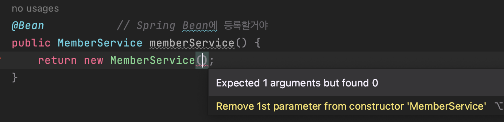
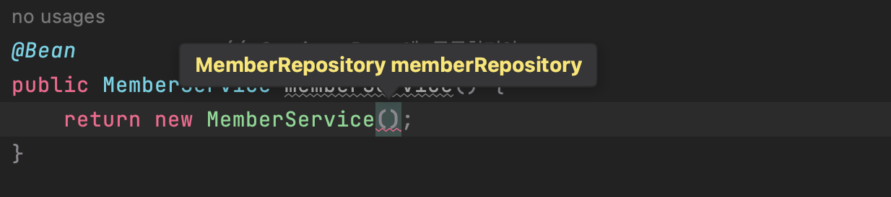

### [2️⃣ 자바 코드로 직접 스프링 빈 등록하기]

- 이전 시간에는 @Service, @Repository, @Autowired 어노테이션을 통해 자동 컴포넌트를 생성하고 Autowired로 엮어주었다.
  
- 이번에는 설정 파일에서 등록하는 방법!
  
- @Autowired은 스프링 빈에 등록된 객체(= 스프링이 관리)가 아니면 동작하지 않는다.
  

#

### IntelliJ 단축키



`cmd + P` : 호출한 생성자의 파라미터를 알고 싶은 경우



- `pvsm` 단축키: 자동 main문 생성
  
  ```java
  public static void main(String[] args) {
          
      }
  ```
  

<br>

---

### 2️⃣ 자바 코드로 직접 스프링 빈 등록하기

```java
@Configuration
public class SpringConfig {

    @Bean                   // = Spring Bean에 등록할거야
    public MemberService memberService() {
        return new MemberService(memberRepository());           // 파라미터 repository는 아래의 메소드를 호출하자
    }

    public MemberRepository memberRepository() {
        return new MemoryMemberRepository();        // 구현체인 MemoryMemberRepository를 리턴해야 함
    }
}


- hello.hellospring > SpringConfig.java
```

- Config 파일 하나 만들어서 (@Configuration) 직접 @Bean에 등록하고 싶은 생성자 반환하는 메소드 작성해주기
  
  - 회원 서비스나 리포지토리는 직접 등록이 가능하지만, Controller는 스프링이 알아서 관리하고 있기 때문에 자동 컴포넌트 스캔을 위해 어노테이션 @Controller, @Autowired를 이용한다.
    

<br>

### DI 3가지 주입법

- 필드 주입
  
  - `@Autowired private MemberService memberService;`
    
  - 중간에 변경할 수 있는 방법이 없음. 고정적 → 비추천
    
- setter 주입
  
  - ```java
    @Autowired
        public void setMemberService(MemberService memberService) {
            this.memberService = memberService;
        }
    ```
    
  - 단점: setter 함수는 언제나 public으로 열려있어야 하기 때문에, setMemberService를 중간에 바꿔치기 가능 (노출 가능성)
    
- **생성자 주입⭐️**
  
  - ```java
    @Autowired                // spring container에 있는 memberService와 연결시켜줌
        public MemberController(MemberService memberService) {          // DI 생성자 주입 방법
            this.memberService = memberService;
        }
    ```
    
  - 생성자 매개변수를 통해 스프링 빈에 올라와있는 MemberService 객체를 끌어와 사용
    
  - **MemberController 생성 시점에 MemberService를 주입**해 의존관계를 확실하게 성립 = 의존관계가 실행 중 동적으로 변하는 경우가 거의 없다.👍
    

<br><br>

⭐️ 정형화된 컨트롤러, 서비스, 리포지토리를 개발할 때는 자동 컴포넌트 스캔 이용<br>

⭐️ 상황에 따라 구현 클래스를 변경해야 하면 설정(Config)를 통해 스프링 빈 직접 등록
